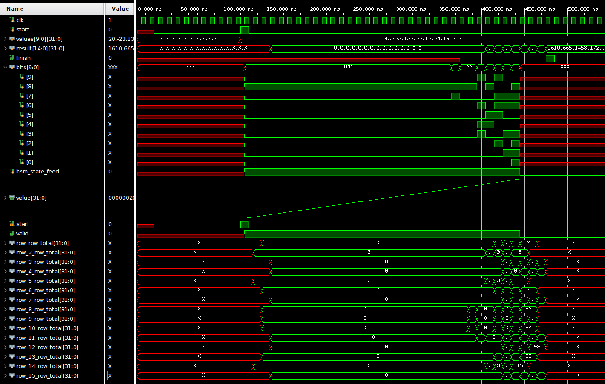

# Bit Serial Matrix Multiply example in SUS

This is an example hardware project written in [SUS](https://github.com/pc2/sus-compiler/). It implements the Bit Serial Matrix Multiplication algorithm for efficient FPGA synthesis of Vector by Compile Time Matrix Multiplication. The main trick here is that by streaming the Vector values through the multipliers one bit at a time, instead of INT_SIZExINT_SIZE bit multipliers, you only need 1xINT_SIZE multipliers, which with constant multiplicant optimizes to simple wires. Matrix sparsity can be readily exploited here for cheaper a implementation. 

This example was tested using `sus_compiler --version`: `SUS Compiler 0.0.2`

## Structure
- [`bitSerialMatrixMultiply.sus`](bitSerialMatrixMultiply.sus): File implementing the algorithm
- [`bitSerialMatrixMultiply_tb.sv`](bitSerialMatrixMultiply_tb.sv): SystemVerilog testbench
- [`core.sus`](core.sus), [`util.sus`](util.sus): Standard library files. These have to be bundled together with the project for now, as SUS doesn't have a package manager yet. 
- [`constraints.xdc`](constraints.xdc): Definition for the clock for Vivado synthesis
- [`verilog_output`](verilog_output): sus_compiler output directory. This contains any files the SUS compiler generates. 

## Algorithm

The algorithm contains three major components:
- The input vector shift registers
- The Baked-in 1xINT_SIZE row multipliers
- The shifting result accumulators

Above you see implemented the Bit Shifter modules. These each take in a vector element in cycle 0. In the subsequent cycles they produce one bit per cycle, starting from the MBS. 

These bits are fed to each Row instance, that each is synthesized with the compile-time matrix weights for that row. Each row implements a dot product of the row weights by the 1 bit input vector elements. An example instance of such a row is shown below. 

Finally, the row sums are added to an accumulator register, and to stay in sync with the bit shifter, they are shifted left. 

### A single row
Using SUS parametrizeable modules, each `BitSerialRow` takes the matrix column, picks out the non-zero elements and adds them up conditionally. The adder is implemented with a `TreeAdd` module from `util.sus`

## How to use
- Clone the repository

- Set up the [SUS Compiler](https://github.com/pc2/sus-compiler?tab=readme-ov-file#installation) using the instructions provided there. 

- Generate the SystemVerilog equivalent of your hardware with `sus_compiler --standalone BitSerialMatrixMultiplyTinyIO *.sus`. (The TinyIO variant is only there to reduce pin use so Vivado synthesis wouldn't complain. `--standalone` means the .sv file contains all dependencies of the chosen module.)

- (Optionally) You can do simulation using [Icarus Verilog](https://steveicarus.github.io/iverilog/index.html) and [Surfer](https://surfer-project.org/). For that, run `./simSUS.sh`. 

If you just want to mess around with SUS, then you can stop here. 

## Simulation & Synthesis
If you wish to go deeper, then you can take the files in [verilog_output](verilog_output) and use them in downstream tools:

These were performed using [Vivado](https://www.xilinx.com/support/download.html) on the resulting [verilog_output/BitSerialMatrixMultiplyTinyIO_standalone.sv](verilog_output/BitSerialMatrixMultiplyTinyIO_standalone.sv)

Waveform:

Synthesis:

